# German Credit Risk

# 1- Introduction

German credit risk data has 1000 observations with 20 variables. The target variable is binary. 

Age (numeric)

Sex (text: male, female)

Job (numeric: 0 - unskilled and non-resident, 1 - unskilled and resident, 2 - skilled, 3 - highly skilled)

Housing (text: own, rent, or free)

Saving accounts (text - little, moderate, quite rich, rich)

Checking account (numeric, in DM - Deutsch Mark)

Credit amount (numeric, in DM)

Duration (numeric, in month)

Purpose(text: car, furniture/equipment, radio/TV, domestic appliances, repairs, education, business, vacation/others

Risk (Value target - Good or Bad Risk)

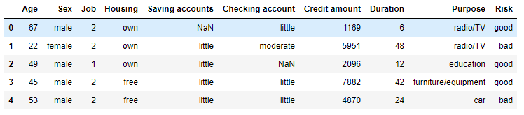

# 2- Libraries 

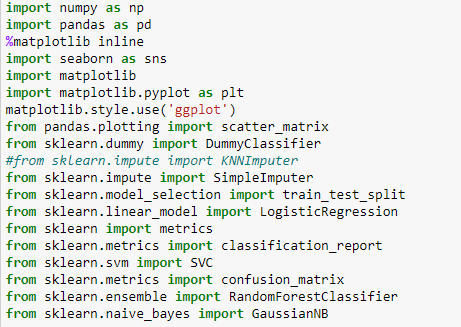

# 3- Preprocessing

- There are missing values in savings accounts and checking accounts. It means that these customers do not have any savings account or checking accounts.NaN values are converted to None and defined as a categorical variable in both variables.

- Outlier check is made with seaborn boxplots. There are many observations that are out of the inter-quartile range but the analyst did not consider them as outliers. There are different customers patterns or customer groups like young customer claiming for high credit amount with short duration or old customer claiming for low credit amount with long duration etc.

- Saving_Accounts, Checking_Account and Risk are categorical data and are converted to numerical data.

- Dummy variables are created for Sex, Job, Housing and Purpose

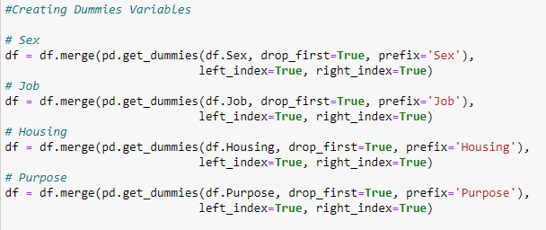

# 4- Exploratory Data Analysis (EDA)

- Pair Plotting: All variables are compared with each other and colored according to the target variable Risk

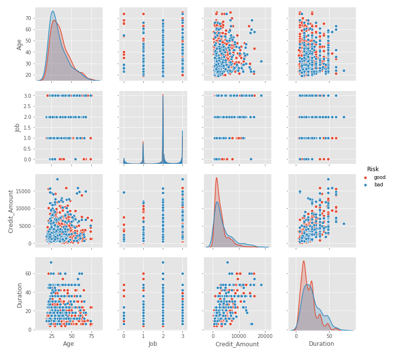

- Scatter Plot: Credit Amount & Duration and Credit Amount & Age are plotted 

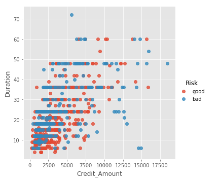

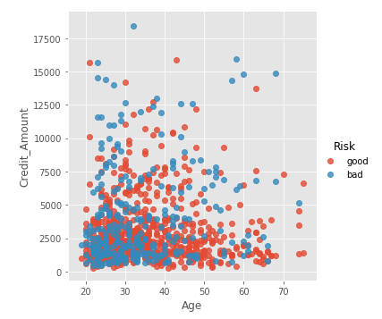

- Pair Comparisons: These comparisons are made for Sex, Job, Saving_Accounts, Checking_Account and Purpose

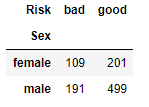

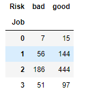

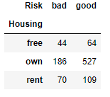

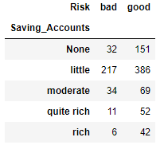

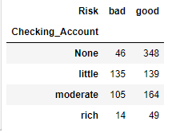

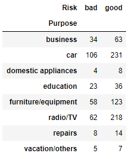
